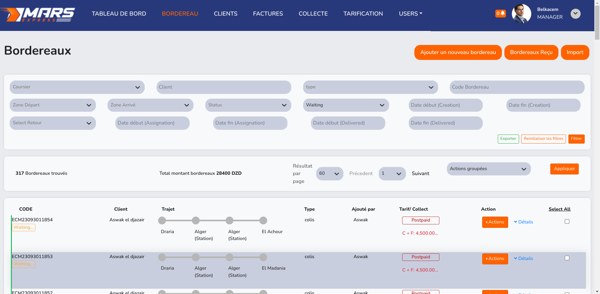
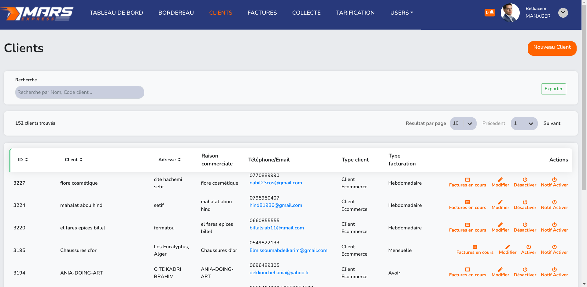
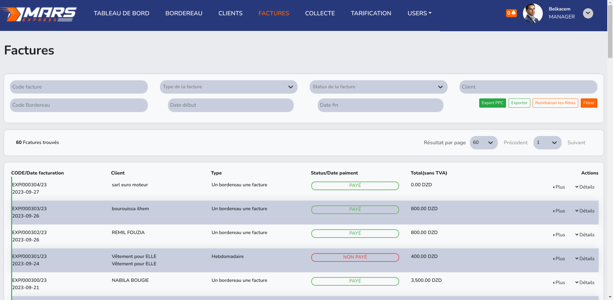
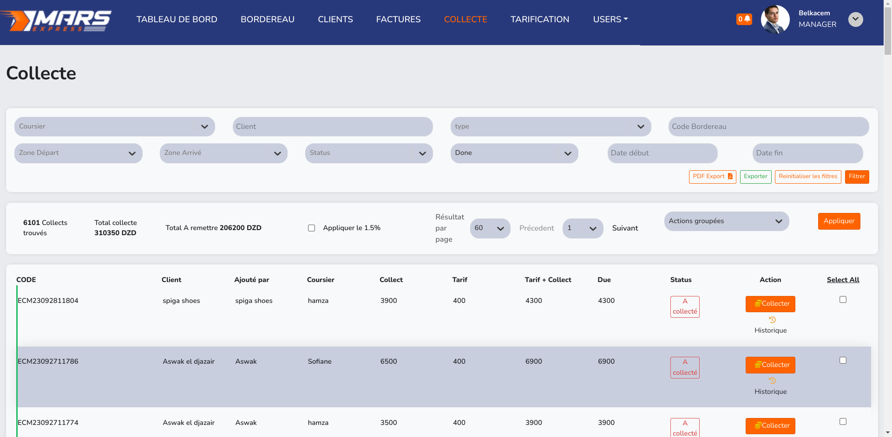
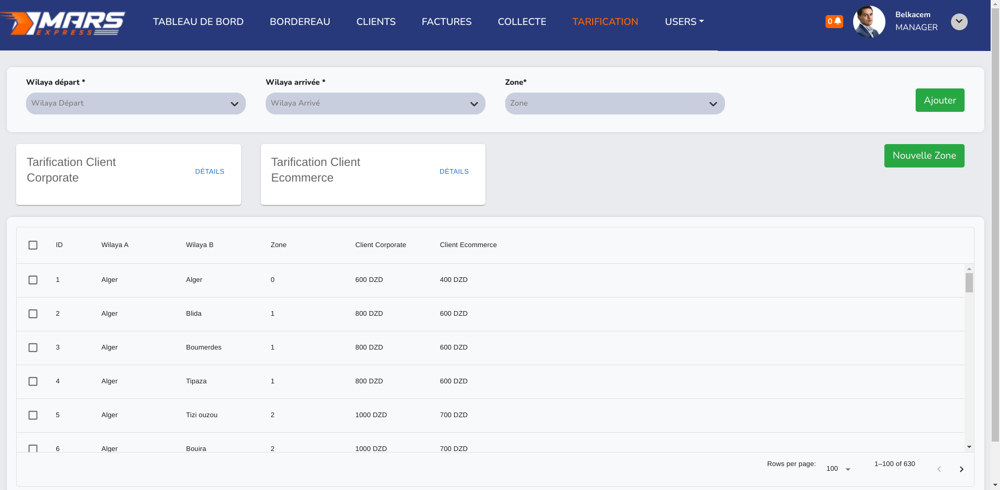
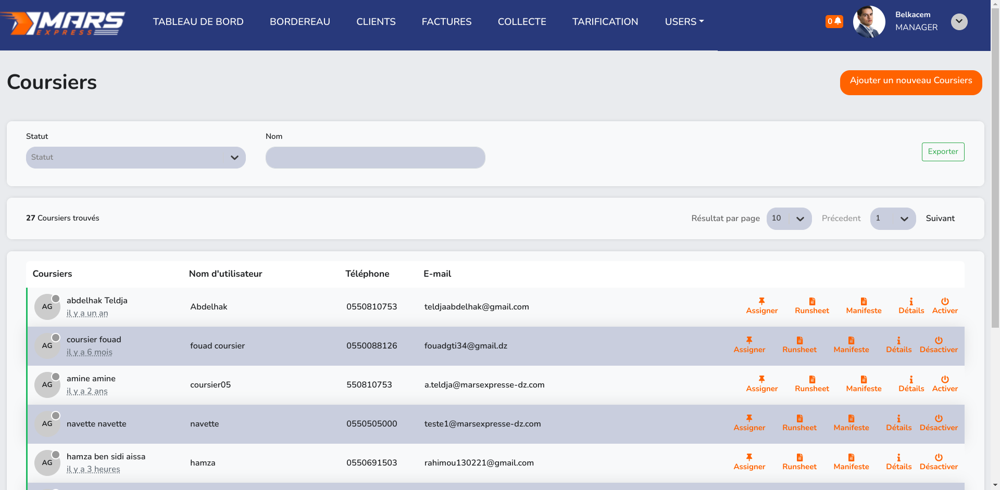
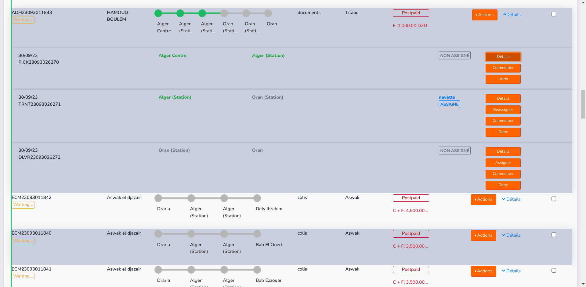
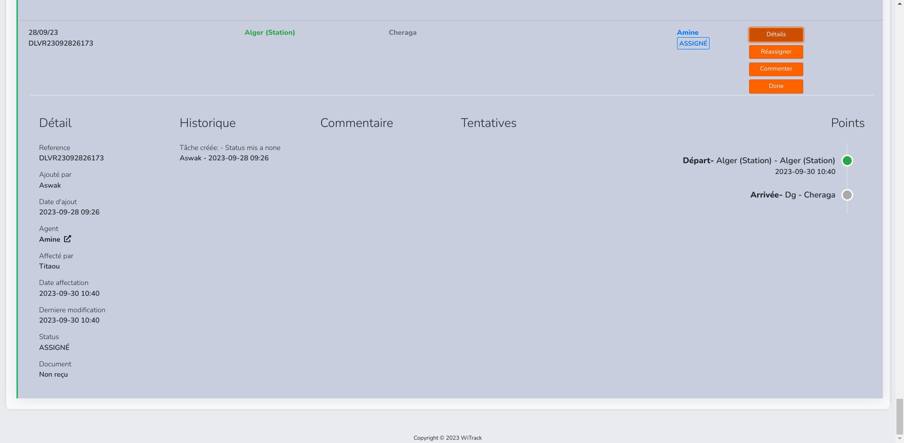

# Mars express web:

**Mars Express** is a comprehensive web application designed to streamline logistics operations for a parcel delivery company. With distinct roles for administrators, supervisors, agents, and clients, Mars Express offers a robust suite of features to efficiently manage parcel delivery tasks, track parcel status and location, and facilitate seamless communication and collaboration across the organization.

[Link to landing page/website](https://marsexpress.dz/)

## Key Features:

- **Role-based Access Control**: Mars Express supports multiple user roles, including admin, supervisor, agent, and client, each with specific permissions and access levels tailored to their responsibilities.

- **Parcel Management**: Administrators, supervisors, and agents can effortlessly manage parcel details, including creation, assignment, and tracking. Users can view comprehensive parcel information, such as status, assigned tasks, delivery details, and comments, ensuring transparency and accountability throughout the delivery process.

- **Logistics Management**: Users can efficiently handle logistics tasks, such as fetching parcels, updating parcel status, managing delivery pricing, and handling exceptions for clients. Mars Express offers extensive filtering options, allowing users to search and filter parcels by date, client, status, area/zone, and more.

- **Payment Management**: The application provides robust payment management capabilities, enabling users to track paid deliveries, monitor collection amounts, and manage outstanding dues. Detailed payment logs record transaction history, including collections, refunds, and client payments, ensuring accurate financial tracking and reporting.

- **Client Management**: Mars Express facilitates client management tasks, allowing users to add, update, and manage client information, as well as configure exceptions and discounts. Users can view connected drivers (delivery personnel), enhancing coordination and communication.

## Technologies Used:

- Backend: PHP with Symfony framework, python
- Frontend: React

## ui :
**The UI design of Mars Express was established prior to my involvement in the project. When I took over the project after the departure of the previous developer, I continued to work within the existing UI framework and style guidelines. While I acknowledge that the current UI may not align with my personal preferences, I focused on maintaining consistency and adhering to the established design patterns while adding new components and features to the application.**

 
 
 
 
 
 
 
 
